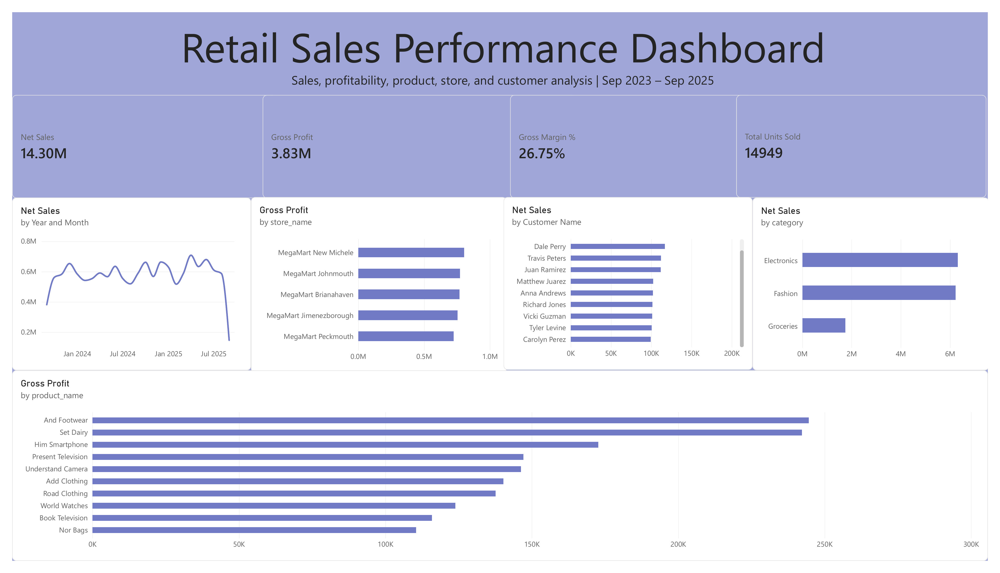

# Retail Sales Analysis

## Project Overview

This project analyzes retail sales data to better understand the company's sales, profitability, customers, products, and store performance.

I used PostgreSQL and SQL to explore the dataset and answer different business questions. I then connected the PostgreSQL database to Power BI and created an interactive dashboard to visualize the results.

The dataset covers sales from September 2023 to September 2025.

## Tools Used

- PostgreSQL
- SQL
- Power BI
- DAX
- Excel/CSV for the original data files

## Dataset

The project uses four tables:

- Customers
- Products
- Stores
- Transactions

The tables were connected using customer IDs, product IDs, and store IDs.

## Questions I Looked At

Some of the questions I explored were:

- How much net sales did the company generate?
- How much gross profit did the company generate?
- What was the overall gross margin?
- How did sales change from month to month?
- Which product categories generated the most sales?
- Which stores generated the most gross profit?
- Which products generated the most gross profit?
- Who were the top customers by net sales?
- How did discounts affect sales and units sold?

## Key Findings

- Total net sales were approximately $14.30 million.
- Gross profit was approximately $3.83 million.
- Overall gross margin was approximately 26.75%.
- A total of 14,949 units were sold.
- Electronics and Fashion generated much more sales than Groceries.
- MegaMart New Michele generated the highest gross profit among the five stores.
- And Footwear and Set Dairy were the two highest products by gross profit.
- Dale Perry was the highest customer by net sales.
- Monthly sales generally stayed between roughly $500K and $700K during full months.

The first and last months in the dataset are partial months, so they should not be directly compared with full months.

## Dashboard

The Power BI dashboard includes:

- Net Sales
- Gross Profit
- Gross Margin %
- Total Units Sold
- Monthly Sales Trend
- Sales by Category
- Gross Profit by Store
- Top Products by Gross Profit
- Top Customers by Net Sales

## SQL Analysis

The SQL portion of the project includes:

- Basic data exploration
- Aggregations using SUM, COUNT, and AVG
- GROUP BY and ORDER BY
- Table joins
- Sales calculations
- Gross profit and gross margin calculations
- Customer analysis
- Store performance
- Product performance
- Monthly sales trends

## What I Learned

This project helped me get more comfortable using SQL on a full dataset instead of only doing practice problems.

I practiced joining multiple tables, grouping data, using aggregate functions, and calculating business metrics such as net sales, gross profit, and gross margin.

I also learned how to connect a PostgreSQL database to Power BI, create relationships between tables, write basic DAX measures, and turn SQL analysis into an interactive dashboard.
